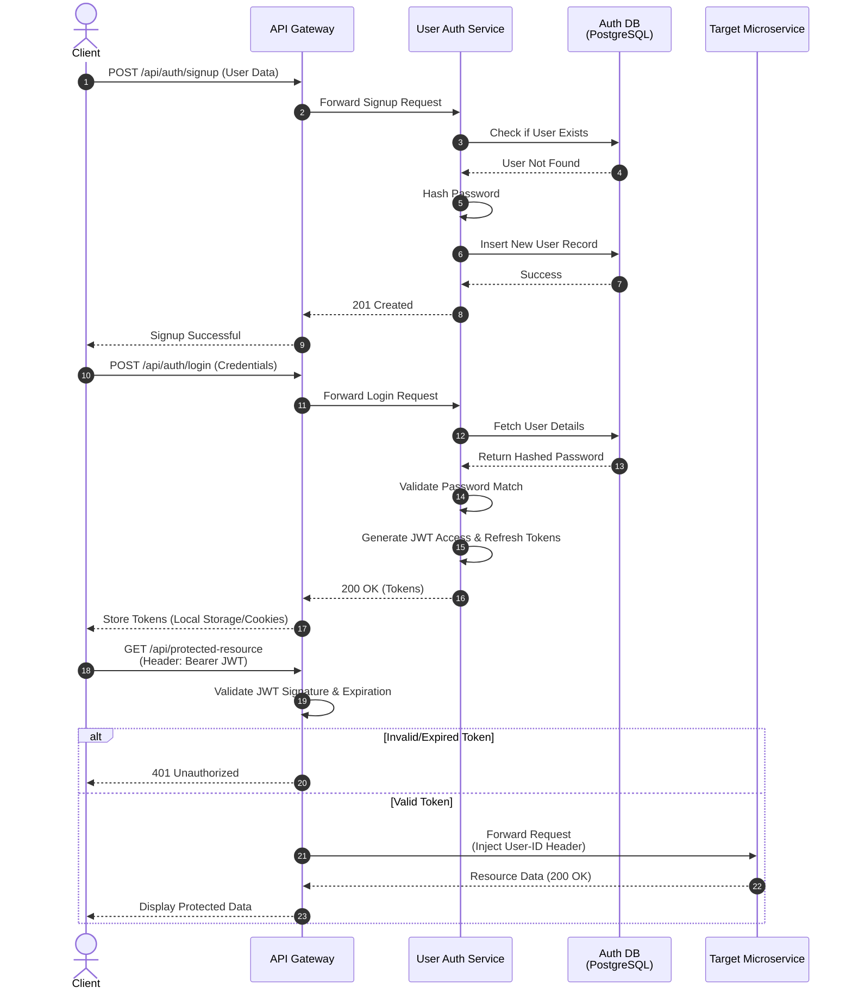
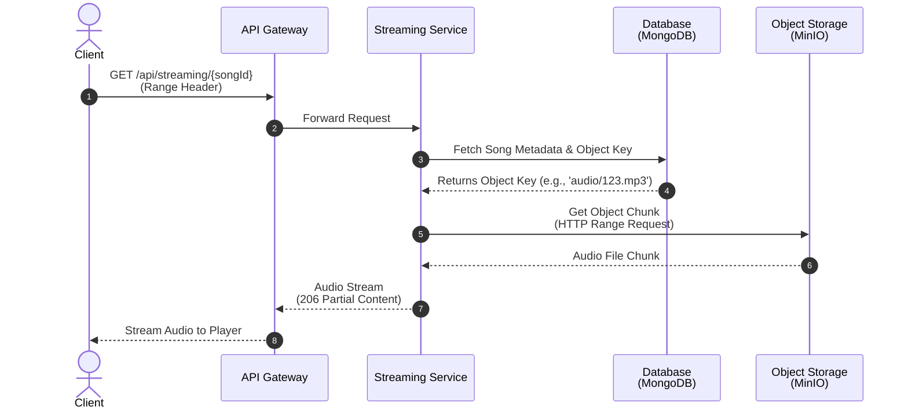
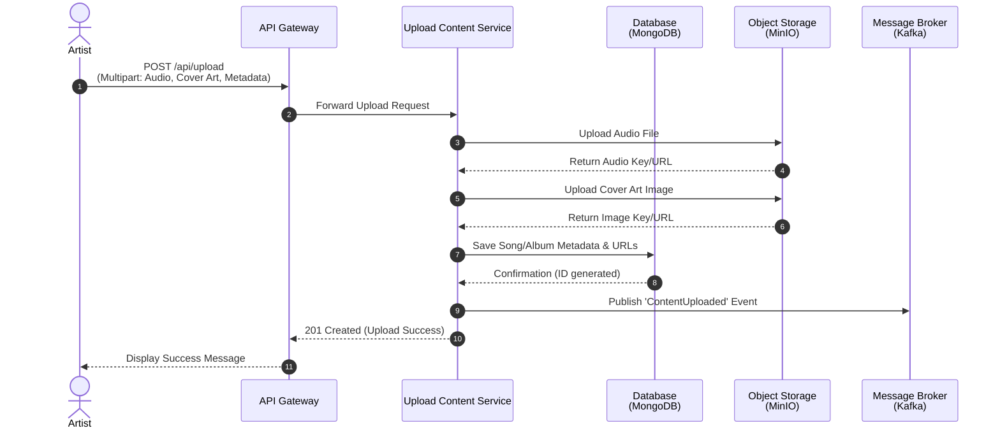
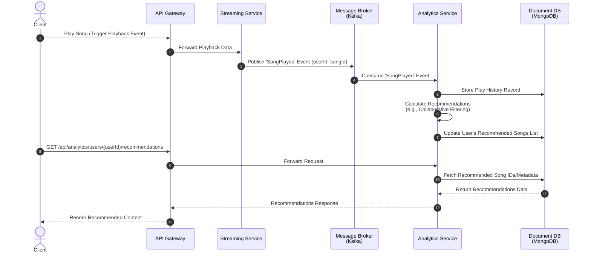

# Sonus - Distributed Audio Streaming Platform


Sonus is a scalable, microservices-based audio streaming application designed for high-performance and non-blocking streaming. The platform provides functionalities for users to stream music, for artists to upload content, and uses an event-driven architecture to compute analytics and recommendations in real-time.

## System Architecture & Technologies

The platform is divided into a React-based frontend and a robust Kotlin Spring Boot backend ecosystem:

- **Backend:** Kotlin, Spring Boot, Spring WebFlux, Project Reactor
- **Frontend:** React, TypeScript, TailwindCSS
- **Databases:** PostgreSQL (Relational Data), MongoDB (NoSQL Data)
- **Object Storage:** MinIO (S3-compatible) for storing audio chunks and images
- **Message Broker:** Apache Kafka for asynchronous event-driven communication
- **Search & Analytics:** For complex search queries and statistics
- **API Gateway:** Centralized entry point, routing, and security.

### Core Microservices

1. **Streaming Service:** Serves audio files reactively. Fetches streams from MinIO and sends them to the client via `Flux<DataBuffer>` to ensure non-blocking memory usage. Publishes events to Kafka upon song plays.
2. **User Auth & Management Service:** Handles JWT-based authentication, user roles (USER / ARTIST), and account management using Spring Security and PostgreSQL.
3. **Upload Content Service / Artist Service:** Allows artists to publish new tracks and albums. Uploads raw files to MinIO, saves metadata in PostgreSQL, and produces Kafka events to notify subscribers.
4. **Analytics Service:** Acts as a Kafka consumer for "song played" events. Indexes data in MongoDB to generate user preference reports (top artists, top genres) and recommendations.
5. **Notification Service:** Decoupled service that listens to artist updates and sends real-time notifications to subscribed users.

---

## System Workflows

The system's core functionalities are best illustrated through the following interaction diagrams:

### 1. User Signup & Authentication

The authentication flow utilizes JSON Web Tokens (JWT) for secure, stateless authorization across all microservices.



### 2. Audio Streaming

The streaming functionality uses reactive programming (Spring WebFlux) to serve partial content (HTTP 206) chunk by chunk, drastically reducing server memory overhead.



### 3. Content Upload (Artist Flow)

Artists upload their music through a dedicated service. The actual audio files are stored securely in MinIO, while the structural metadata is persisted in the relational database.



### 4. Recommendations & Analytics

Every time a user listens to a song, the system asynchronously calculates statistics without blocking the audio stream.



## UI Preview
### Welcome Page


### The Explore Page - where user is able to search for songs, artists, albums, and even get recommendations based on their previous listening activity and liked content


### Media Player - Extended Mode


### Artist Dasboard for available statistics and profile editing


## Getting Started

To run the Sonus backend locally, make sure you have Docker installed. The project provides a `docker-compose.yml` to spin up all necessary infrastructure (PostgreSQL, MongoDB, MinIO, Kafka).

1. Clone the repository
2. Run infrastructure containers:
   ```bash
   docker-compose up -d
   ```
3. Start the individual microservices via your IDE or Gradle:
   ```bash
   ./gradlew bootRun
   ```

*Note: For the frontend repository, navigate to `sonus-frontend` and use `npm install` and `npm run dev`.*
